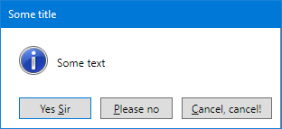

# WpfMessageBox

[](https://www.nuget.org/packages/WpfMessageBox) [](https://ci.appveyor.com/project/Otiel/wpfmessagebox/branch/master) [](https://ci.appveyor.com/project/Otiel/wpfmessagebox/branch/develop)

## Description

WpfMessageBox is a WPF message box implementation, aimed to be visually balanced between the default WPF style and the native .NET MessageBox. It offers the following features:

* Returns the standard .NET [MessageBoxResult](https://docs.microsoft.com/en-us/dotnet/api/system.windows.messageboxresult)s.
* Uses the standard MessageBox [icons](https://docs.microsoft.com/en-us/windows/desktop/uxguide/vis-std-icons).
* Ability to define custom buttons text.
* Optional header text.
* Optional TextBox.
* Optional CheckBox.




## Usage

1. Install through [Nuget](https://www.nuget.org/packages/WpfMessageBox)
2. WpfMessageBox uses static method like the standard .NET MessageBox:

    ```
    using WpfMessageBoxLibrary;

    MessageBoxResult result = WpfMessageBox.Show("Some text", "Some title", MessageBoxButton.OK, MessageBoxImage.Exclamation);
    ```
3. In order to use the extra features offered by WpfMessageBox, you need to initialize a new `WpfMessageBoxProperties` which will hold the desired properties, then use the relevant static method:

    ```
    using WpfMessageBoxLibrary;

    var msgProperties = new WpfMessageBoxProperties() {
        Button = MessageBoxButton.OKCancel,
        ButtonOkText = "Set name",
        CheckBoxText = "Don't ask again",
        Image = MessageBoxImage.Exclamation,
        Header = "No name defined",
        IsCheckBoxChecked = true,
        IsCheckBoxVisible = true,
        IsTextBoxVisible = true,
        Text = "Please enter the name to use. You can leave the field empty in order to continue using the default name.",
        Title = "A nice example",
    };

    MessageBoxResult result = WpfMessageBox.Show(this, ref msgProperties);
    ```

4. The `WpfMessageBoxProperties` object allows you to retrieve the `TextBox` and `CheckBox` values after the user closed the message box:

    ```
    bool checkBoxChecked = msgProperties.IsCheckBoxChecked;
    string textBoxContent = msgProperties.TextBoxText;
    ```

More examples can be found in the Demo project of this repository.

## Release notes

See the [changelog](CHANGELOG.md).

## License

WpfMessageBox is licensed under the MIT license - see the [LICENSE](LICENSE) file for details.
